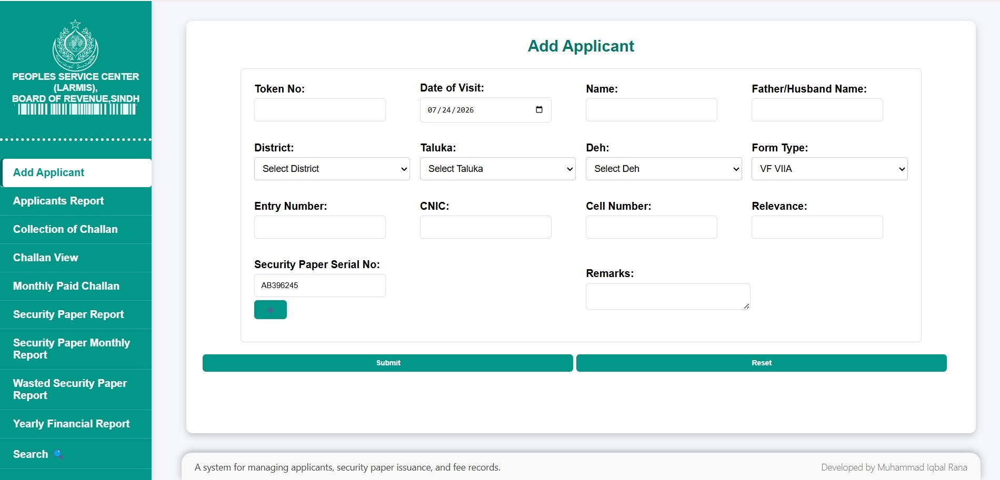
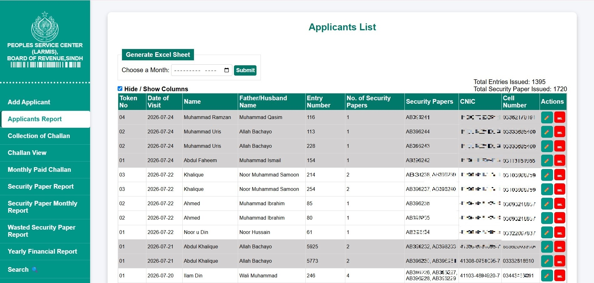
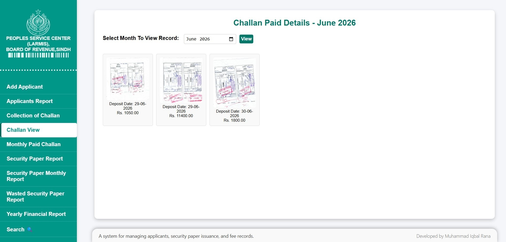
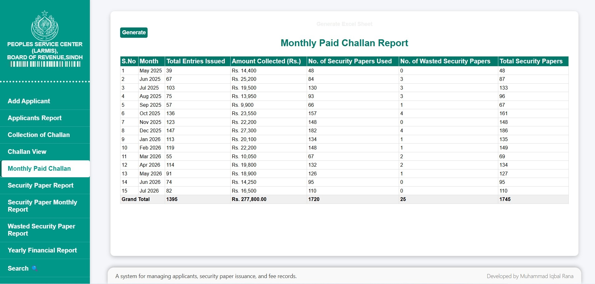
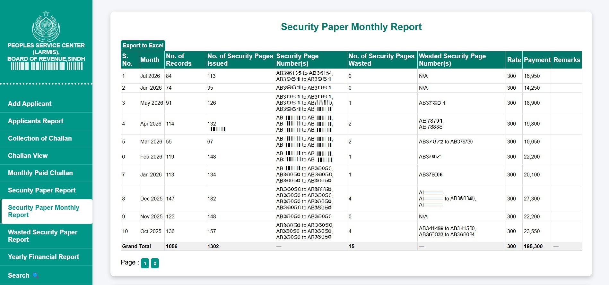
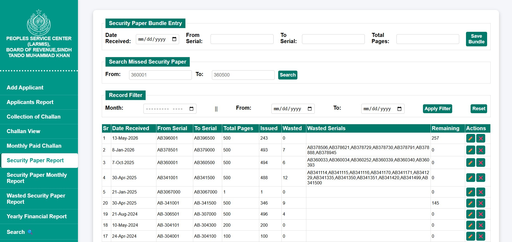
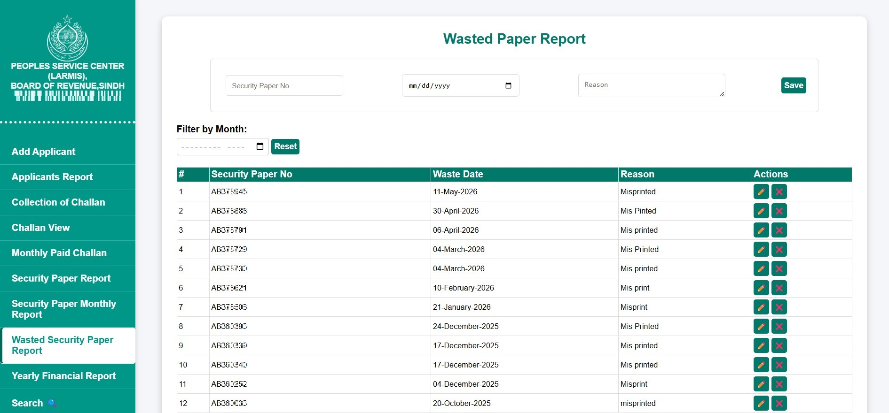
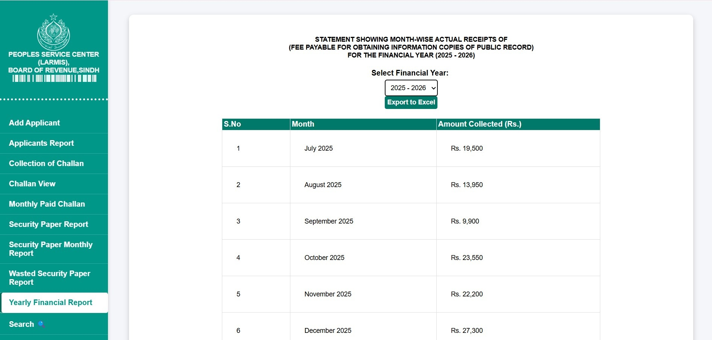

# 📄 Applicant & Fee Management System

A comprehensive **Core PHP & MySQL** web application designed to manage applicants, security paper issuance and wasted count, fee collection, paid bank challan receipts, and administrative records. The system provides inventory tracking, fiscal year reporting (July–June), AJAX-powered search, and Excel report generation for efficient record management.

---

## ✨ Features

- Applicant Registration & Management
- Security Paper Serial Number Management
- Security Paper Bundle Management
- Fee Collection Management
- Paid Bank Challan Management
- Wasted Security Paper Tracking
- AJAX-Based Search & Filtering
- Fiscal Year Reports (July–June)
- Monthly & Yearly Reports
- Excel Report Generation
- Dashboard Statistics

---

## 🛠 Technology Stack

- Core PHP
- MySQL
- HTML5
- CSS3
- Bootstrap
- JavaScript
- AJAX
- PhpSpreadsheet

---

## 📸 Screenshots

### Applicant Entry


### Applicant Report


### Paid Challan


### Monthly Challan Report


### Security Paper Monthly Report


### Security Paper Report


### Wasted Security Paper Report


### Yearly Financial Report


---

## 📊 Reports

- Fiscal Year Report (July–June)
- Monthly Paid Challan View / Report
- Monthly Security Paper Report
- Security Paper Receiving Report
- Fee Collection Report
- Excel Export

---

## 🚀 Installation

1. Clone the repository.
2. Import `database/security_paper_management.sql`.
3. Update your database configuration.
4. Run the project using XAMPP or Laragon.

---

## 📖 Usage Instructions

### Default Login

- **Username:** `admin`
- **Password:** `admin321`

### Getting Started

1. Open **Security Paper Report** (`security_paper_report.php`).
2. Add the available security paper range before registering applicants.

Example:

```
From: AB396001
To:   AB396500
```

### Applicant Registration

- The next available security paper serial number is assigned automatically using AJAX.
- The assigned serial number can be edited manually, and additional serial numbers can also be assigned if required.
- A single applicant may have multiple records.
- Applicant details (Token No., Date of Visit, Name, Father/Husband Name, CNIC, Cell Number, District, Taluka, and Deh) remain populated for consecutive entries to speed up data entry. Usually, only the Entry Number needs to be changed.
- Click **Reset** before entering a new applicant.

### Sample Data

The database contains dummy data for:

- District
- Taluka
- Deh (Agricultural Land)

### Note

This project was developed for a specific administrative workflow. Certain validations and restrictions are intentionally implemented according to operational requirements.

---

## 👨‍💻 Author

**Muhammad Iqbal Rana**

Core PHP • MySQL • JavaScript • AJAX • Bootstrap
